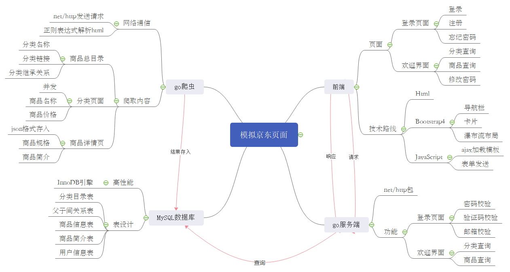

# Daenerys

## 项目概述
* go语言实现的web服务器，具有注册登录逻辑
* 数据库数据从京东商品爬取
* 实例网页可在[Daenerys](http://154.8.143.128:18080)访问

### 项目体系    

### 爬虫 jdSpider
* 正则表达式解析网页
* 抓取[京东商品分类页](https://www.jd.com/allSort.aspx),得到分类名称、分类关系，结果存入分类目录表和父子间关系表
* 并发爬取各分类页面，得到商品名称、商品价格，结果存入商品信息表
* 爬取商品详情页，得到商品简介、商品规格，以json格式存入商品简介表

### MySQL数据库 sqlgo
* InnoDB引擎
* 建表明细
    * 分类目录表

        `create table IF NOT EXISTS classTable( /* 创建分类目录*/`
   							
		`class_id int auto_increment, /*分类id，自增*/`

        `class_name varchar(20),/*分类名称*/`
	
		`class_href varchar(50),/*分类链接*/`
		
		`primary key(class_id))`

		`engine=InnoDB default charset=utf8`
        
    * 商品信息表
    
        `create table IF NOT EXISTS goodsTable(/*创建商品信息表*/`

		`goods_id int auto_increment,/*商品id*/`

		`class_id int,/*商品对应分类id*/`

		`goods_name varchar(100),/*商品名称*/`

		`goods_price float,/*商品价格*/`

		`goods_href text,/*商品链接*/`

		`primary key(goods_id))`

		`engine=InnoDB default charset=utf8`

    * 分类关系表
    
        `create table IF NOT EXISTS classRelate(/*创建分类关系表*/`

        `class_id int,/*分类id*/`

		`pid int,/*父分类id*/`

		`primary key(class_id))`

        `engine=InnoDB default charset=utf8`

	* 商品简介表

		`create table IF NOT EXISTSgoodsIntro(/*创建商品简介表*/`
		
		`goods_id int,/*商品id*/`

		`intro json,/*商品简介*/`

		`primary key(goods_id))`
		
		`engine=InnoDB default charset=utf8`

	* 用户信息表

		`create table IF NOT EXISTS userInfo(/*创建用户信息表*/`
								
		`user_id int auto_increment,/*用户id*/`

		`user_name varchar(20),/*用户名*/`

		`user_email varchar(50),/*用户邮箱*/`

		`primary key(user_id))`

		`engine=InnoDB default charset=utf8`

### 服务端 web.go
* net/http包
* 登录页面
	* 密码校验：redis储存用户名和密码
	* 图片验证码校验：借助`github.com/dchest/captcha`包，相关url：`/process`,`/captcha/newId`
	* 邮箱验证：借助`github.com/go-gomail/gomail`包发送邮件，将验证码存入redis，用于邮箱地址和验证码的校验
* 欢迎页面
	* 分类查询：根据分类id或分类名称进行mysql查询
   	* 商品查询：根据商品id或商品名称进行mysql查询
	* 用户管理：修改密码
* 文件服务器
	* 利用http.FileServer方法，接受前端对目录`/root/static`中文件的请求

### 前端
* html+bootstrap+javascript实现
* 登录界面（./root/test.html）
	* 登录
	* 注册
	* 找回密码
* 分类管理界面（./root/test2.html）
	* 分类管理
		* ajxa加载模板，生成各分类卡片信息
	* 商品管理
		* ajxa加载模板，生成各分类卡片信息
	* 用户管理