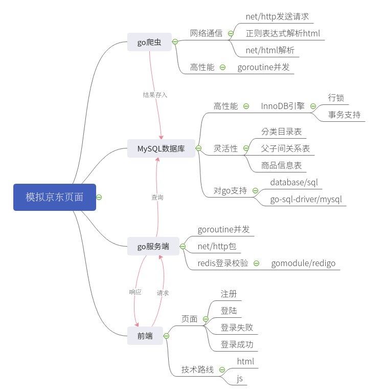
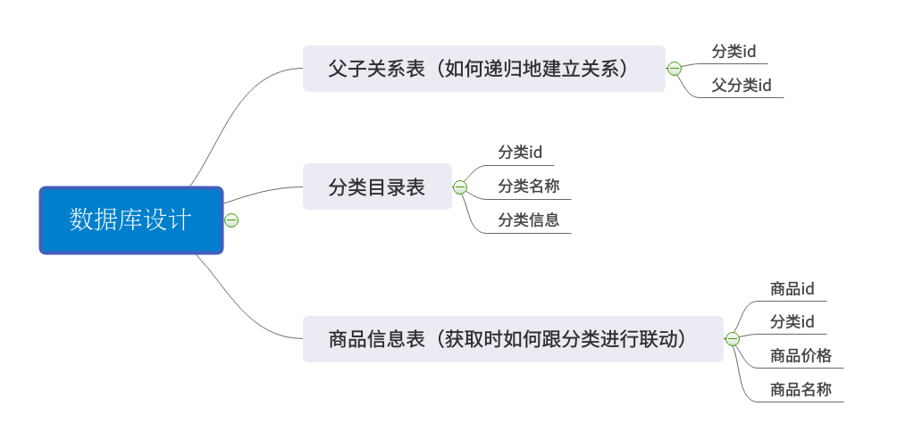

# Daenerys

## 项目概述
* go语言实现的web服务器，具有注册登录逻辑
* 数据库数据从京东商品爬取

### 项目体系    

### 爬虫
* go爬虫抓取[京东商品分类页](https://www.jd.com/allSort.aspx),存储到mysql表中
* 正则表达式解析网页
* 并发

### MySQL数据库
* InnoDB引擎，更高粒度的锁，更好的并发性能
* 数据库结构

* 建表语句
    * 分类目录
    * 商品信息表（获取时如何跟分类进行联动）
    * 父子关系表（如何递归地建立关系）

### 服务端
* golang，暂不借助其他框架

### 注册登录功能
- [x] session/cookie实现登录验证
- [ ] redis实现登录验证

### 前端页面
* 常规html+bootstrap+js实现
* 注册、登录、登陆失败、登录成功四个页面