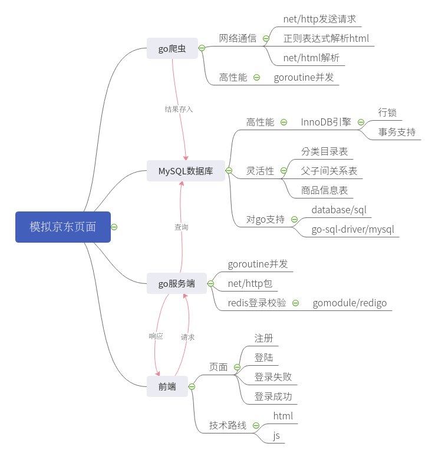
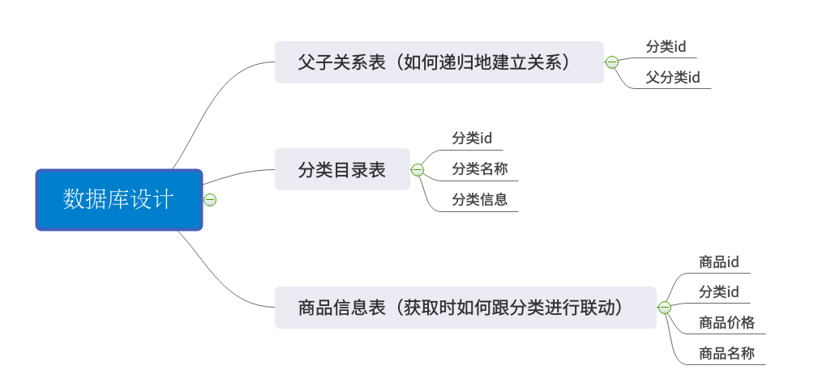
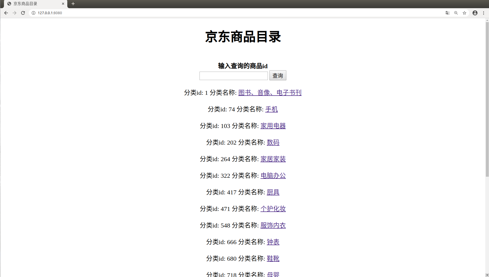
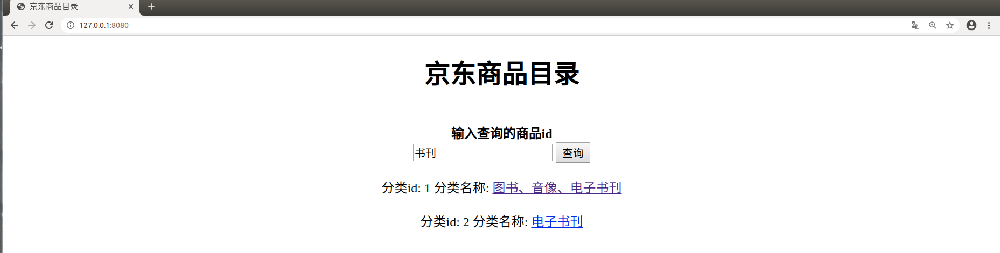

# Daenerys

## 项目概述
* go语言实现的web服务器，具有注册登录逻辑
* 数据库数据从京东商品爬取
* 实例网页可在[Daenerys](http://154.8.143.128:18080)访问

### 项目体系    

### 爬虫 jdSpider
* go爬虫抓取[京东商品分类页](https://www.jd.com/allSort.aspx),存储到mysql表中
* 正则表达式解析网页

### MySQL数据库 sqlgo
* InnoDB引擎，更高粒度的锁，更好的并发性能
* 数据库结构

* 建表语句
    * 分类目录
    
        `create table IF NOT EXISTS classTable(
         								class_id int auto_increment,
         								class_name varchar(20),
         								class_href varchar(50),
         								primary key(class_id))
         								engine=InnoDB default charset=utf8
         								`
        
    * 商品信息表（获取时如何跟分类进行联动）
    
        `create table IF NOT EXISTS goodsTable(
         								goods_id int auto_increment,
         								class_id int,
         								goods_name varchar(20),
         								goods_price float,
         								goods_href varchar(50),
         								primary key(goods_id))
         								engine=InnoDB default charset=utf8
         								`
    * 父子关系表（如何递归地建立关系）
    
        `create table IF NOT EXISTS classRelate(
        class_id int,        pid int,        primary key(class_id))
        engine=InnoDB default charset=utf8`

### 服务端 web.go
* golang，暂不借助其他框架
* 完成京东分类目录界面

* 实现根据分类id或分类名称进行查询
    
   
* 查询语句
    * queryById  
    
        `queryById = select a.class_id,a.class_name,a.class_href 
     					from classTable as a join classRelate as b 
     					where a.class_id = b.class_id and 
     					(b.pid = ? or b.class_id = ?);` 
    * queryByName
    
        `queryByName = select a.class_id,a.class_name,a.class_href 
      						from classTable as a join classRelate as b 
      						where a.class_id = b.class_id and 
      						a.class_name regexp '%s';`
   

### 注册登录功能 redis
- [ ] session/cookie实现登录验证
- [x] redis实现登录验证
- 未完成

### 前端页面
* 常规html+bootstrap+js实现
* 注册、登录、登陆失败、登录后四个页面

